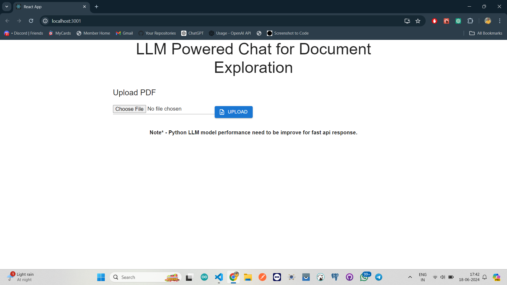
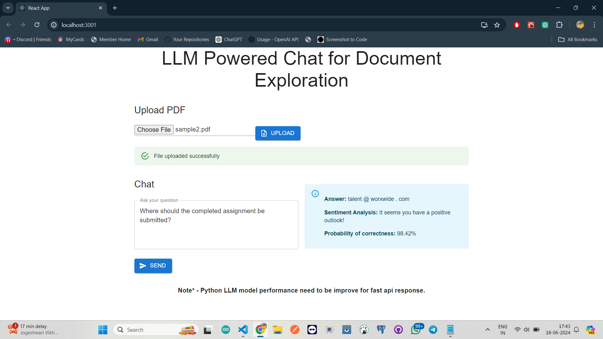

# React Chat App with LLM-Python

This project is a chat application that leverages a Large Language Model (LLM) for document exploration. It allows users to upload a PDF document and ask questions related to the content of the document. The backend uses Python for NLP processing and Node.js for handling API requests. The frontend is built with React.

## Demo






## Features

- Upload PDF documents for analysis.
- Ask questions related to the uploaded document.
- Receive answers with sentiment analysis and confidence scores.
- User-friendly interface with real-time feedback.

## Prerequisites

- Node.js
- Python 3.9 or higher
- PostgreSQL
- Git

## Installation

1. **Clone the repository:**

    ```sh
   git clone https://github.com/prashant774/React-Chat-app-with-llm-python.git

   cd React-Chat-app-with-llm-python
   ```

2. **Backend Setup:**

   Navigate to the backend directory:

   cd chatappBackend

   Install dependencies:
    ```sh
   npm install
    ```
   Create a `.env` file in the chatappBackend directory with the following content:

    ```sh
   DB_USER=postgres
   DB_PASSWORD=123456
   DB_HOST=localhost
   DB_PORT=5432
   DB_DATABASE=chatapp
   PORT=3000
    ```
   Start the backend server: 
   ```sh 
   node index.js
   ```

3. **Frontend Setup:**

   Navigate to the frontend directory: 
   ```sh
   cd ../chatapp-frontend
   ```

   Install dependencies:
   ```sh
    npm install
    ```
   Start the frontend server: 
   ```sh
   npm start
    ```

4. **Python Setup:**

   Navigate to the project root directory: 
   ```sh
   cd ../
   Create a Python virtual environment: 
   python -m venv llm_env
    ```
   Activate the virtual environment
    ```sh
   On Windows: llm_env\\Scripts\\activate
    ```
    ```sh
   On macOS/Linux: source llm_env/bin/activate
    ```
   Install Python dependencies:
   ```sh
   pip install -r requirements.txt
   ```

## Database Setup

1. **Create a PostgreSQL database:**

   Open pgAdmin and create a new database named `chatapp`.

2. **Create the required tables:**

   Run the following SQL queries to create the necessary tables:

```sh
   CREATE TABLE documents (
   id SERIAL PRIMARY KEY,
   user_id INT,
   name VARCHAR(255),
   path VARCHAR(255)
   );

   CREATE TABLE chats (
   id SERIAL PRIMARY KEY,
   document_id INT REFERENCES documents(id),
   message TEXT,
   response TEXT
   );
```

## Usage

1. **Upload a PDF:**

   Open the application in your browser at `http://localhost:3001`.

   Click on "Choose File" to select a PDF document and then click "Upload".

2. **Ask a Question:**

   Enter your question in the chat input box and click "Send".

   The response will be displayed along with sentiment analysis and confidence score.

## Note

    Python LLM model performance needs to be improved for faster API response.

## Contributing

    Feel free to fork the repository and submit pull requests. For major changes, please open an issue first to discuss what you would like to change.

## License

    This project is licensed under the MIT License.
